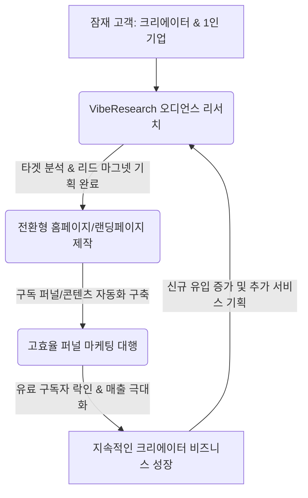

# 🚀 VibeResearch B2B 비즈니스 연계 & 크리에이터 영업 전략 가이드북

이 가이드는 대표님이 기존에 운영하시는 **[홈페이지 제작]** 및 **[마케팅 대행]** 비즈니스에 **VibeResearch(오디언스 리서치 솔루션)**를 융합하여, 고단가 번들 상품을 기획하고 잠재 고객인 크리에이터들에게 어떻게 1:1 아웃리치(영업)를 진행해야 하는지 명확히 짚어주는 비즈니스 실행 매뉴얼입니다.

> 💡 **노션 복사 가이드**  
> 본 가이드의 전체 텍스트를 드래그하거나 파일 전체를 복사하여 Notion 페이지에 붙여넣기(`Ctrl+V`)하시면 깔끔한 노션 서식(토글, 블록, 표, 다이어그램)으로 즉시 변환되어 사내 업무 템플릿으로 바로 활용할 수 있습니다.

---

## 1. 3초 만에 꽂히는 서비스 핵심 정의 (크리에이터용 엘리베이터 피치)

잠재 고객(크리에이터, 1인 창업가)을 만났을 때, 긴 설명 대신 이 한마디로 관심을 유도하세요.

*   **한 줄 요약**: *"크리에이터님, 알고리즘의 노예에서 벗어나 **진짜 돈이 되는 1,000명의 유료 팬**을 모으는 가장 쉬운 방법, 바로 1:1 맞춤형 뉴스레터 비즈니스 리서치 비서입니다."*
*   **핵심 가치 제안 (Value Proposition)**:
    1.  **시간 절약 (Saving Time)**: 주제 하나 리서치하는 데 3일씩 걸리던 과정을 단 3초 만에 요청하여 48시간 내에 전문가급 분석 보고서로 수령.
    2.  **수익 모델 다각화**: 단순 조회수 수익에서 벗어나 구독형 뉴스레터, 전자책, 커뮤니티 등 고단가 지식 창업 비즈니스 모델(BM)을 안전하게 테스트하고 검증.
    3.  **데이터 기반 페르소나 매칭**: 내 채널의 핵심 오디언스를 세밀히 정의하고 이들이 기꺼이 지갑을 열 만한 유료 콘텐츠 주제 추천.

---

## 2. 1인 지식창업 융합 시너지 모델 (홈페이지 + 마케팅 + 리서치)

대표님이 제공 중인 기존 서비스와 VibeResearch를 융합한 비즈니스 밸류 체인은 다음과 같습니다.

### 📊 비즈니스 결합 시너지 구조



### 💰 서비스 연계 고단가 번들 패키지 설계안

기존의 단순 홈페이지 제작 단가에서 벗어나, 리서치와 마케팅이 결합된 **‘고단가 올인원 패키지’**로 업셀링하세요.

| 패키지 명 | 타겟 대상 | 패키지 구성 요소 | 추천 제안가 | 기대 마진 & 효과 |
| :--- | :--- | :--- | :--- | :--- |
| **1. 스타터 패키지** <br>*(지식 창업 씨앗)* | 초기 지식 크리에이터, <br>부업을 시작하는 직장인 | - 뉴스레터 플랫폼 셋팅 (Stibee/MailerLite)<br>- 리서치 비서 이용권 (3회)<br>- 랜딩페이지 기획 템플릿 | **80만 원** | 기획이 약한 초보자들의 실패율을 줄이고 홈페이지 제작으로 유도하는 미끼 상품 |
| **2. 프로 패키지** <br>*(콘텐츠 빌드업)* | 본격 팬덤을 구축하려는 <br>중소형 인플루언서 | - 고전환 구독 랜딩페이지 제작<br>- 오디언스 정밀 분석 (리서치 5회 제공)<br>- 웰컴 이메일 시퀀스(5단계) 자동화 기획 및 연동 | **250만 원** | 대표님의 본업(홈페이지 제작) 고단가 수주에 리서치를 부가 가치 서비스로 무료 얹어 구매율 극대화 |
| **3. 마스터 올인원** <br>*(1인 기업 부스터)* | 고단가 지식 창업을 <br>자동화하려는 1인 기업가 | - 프리미엄 지식 판매용 독립 웹사이트 구축<br>- 타겟별 콘텐츠 전략 리포트 무제한 제공<br>- 초기 타겟 광고 대행 및 유입 분석 (1개월) | **500만 원+** | **홈페이지 + 마케팅 + 리서치**의 완전체 결합 상품으로 건당 단가를 2배 이상 높임 |

---

## 3. 크리에이터 1:1 영업(아웃리치) 상세 시나리오

초기 고객 10명을 유료 모객하기 위한 구체적인 영업 이메일/DM 템플릿입니다.

### ✉️ 인스타그램 DM / 이메일 발송 템플릿

```markdown
제목: [제안] OO 크리에이터님의 콘텐츠 비즈니스를 3배 성장시킬 유료 팬덤 설계도 (무료 리서치 포함)

안녕하세요, OO 크리에이터님!
평소 크리에이터님의 [채널명]에서 다루시는 [주요 콘텐츠 주제] 영상을 인상 깊게 시청하고 있는 VibeResearch 대표 OOO입니다. 

수많은 구독자들이 크리에이터님의 깊이 있는 통찰에 열광하고 있지만, 유튜브/인스타 플랫폼의 알고리즘 변화에 따라 매번 도달률이 널뛰는 상황에서 "내 채널 오디언스를 어떻게 고정 자산화하고 수익으로 직접 연결할 것인가"에 대해 한 번쯤 고민해 보셨을 것이라 생각합니다.

저희는 크리에이터분들이 오디언스와 직접 소통하며 월 200만 원 이상의 안정적인 파이프라인을 구축할 수 있도록 돕는 **'1:1 콘텐츠 & 오디언스 리서치 비서 서비스'**를 제공하고 있습니다.

OO 크리에이터님의 채널을 분석한 결과, 다음 2가지 타겟 분석 리서치를 즉각 진행하면 구독자들의 유료 전환을 극대화할 수 있을 것으로 판단됩니다.
1. [콘텐츠 주제 A]에 반응하는 2030 핵심 구독자의 숨은 니즈 분석
2. 유튜브 구독자를 뉴스레터 유료 구독자로 전환시키는 리드 마그넷(무료 증정 혜택) 기획안

바쁘신 크리에이터님을 대신하여 저희가 이 리서치 보고서를 무료로 1회 정밀 작성하여 보내드리고자 합니다. 
관심이 있으시다면 아래 간단한 항목을 회신해 주시거나 아래 링크에서 신청해 주시면 감사하겠습니다.

- **신청 정보**: [주제 및 핵심 타겟]
- **무료 신청 링크**: https://viberesearch-mvp.vercel.app (가입 시 가상결제로 진행되며 요금이 청구되지 않습니다.)

소중한 창작 시간을 콘텐츠 제작에만 집중하실 수 있도록, 머리 아픈 시장 분석과 타겟 리서치는 저희 비서가 책임지겠습니다.

감사합니다.
VibeResearch 대표 OOO 드림
```

---

## 4. 사업 확장 및 지속가능한 락인(Lock-in) 로드맵

VibeResearch의 궁극적 로드맵은 단순한 AI 리포팅 툴이 아닌, 대표님의 B2B 영업의 **‘핵심 신뢰 자산(Trust-builder)’** 역할을 하는 것입니다.

### 📌 비즈니스 마일스톤 단계별 실행 전략

1.  **1단계: 지인 테스트 및 신뢰 확보 (현재 단계)**
    *   지인 크리에이터 및 초기 모집 인원 10~20명에게 무료 체험 기회 제공.
    *   어드민 패널(`https://viberesearch-mvp.vercel.app/admin`)의 회원 관리 시스템을 통해 초대된 지인만 선별 승인하여 시스템 남용을 제어.
    *   지인들의 실제 후기(예: *"이 리포트 토대로 뉴스레터 발행했더니 구독률이 20% 늘었어요!"*)를 캡처하여 상세 영업 자료로 자산화.
2.  **2단계: 홈페이지/마케팅 대행 고객 대상 업셀링**
    *   홈페이지 제작 미팅 시 브리핑용으로 VibeResearch 리포트를 즉시 인쇄(PDF 저장)하여 고객에게 전달.
    *   고객은 *"내 사업을 위한 타겟 분석을 벌써 이렇게 체계적으로 진행해 줬단 말이야?"*라며 즉각적인 전문성과 감동을 느끼게 됨 ➡️ 높은 계약 성사율.
3.  **3단계: SaaS 구독 서비스 모델 정식 런칭**
    *   테스트가 끝난 후 가상 결제를 실제 PG(Toss Payments 등) 연동으로 교체하여 월 39,000원 상당의 비즈니스 오디언스 구독 모델로 상시 운영.
    *   대표님은 콘텐츠 기획 비서 웹을 통해 안정적인 월 고정 자동 매출(MRR) 확보.

---
*VibeResearch와 함께 대표님의 비즈니스가 날개를 달고 고속 성장하기를 진심으로 응원합니다!*
